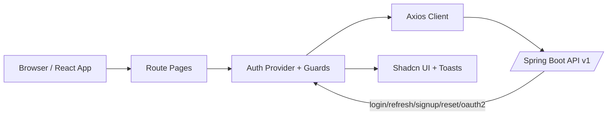

<div align="center">
  <h1>🔐 Auth App Frontend</h1>
  <p><i>Production-ready React + TypeScript frontend for AuthKit (Spring Boot auth backend).</i></p>
  <p>Features Clerk-inspired auth UX, secure session handling, and a beautiful Synthetic Indigo design.</p>
  
  
  
  
  
  
</div>

<br />

## 📸 Overview

<p align="center">
  
</p>

## ✨ Features

| Capability | Status | Notes |
|:---|:---:|:---|
| **Login + Silent Refresh** | ✅ | Access token in memory, refresh via HttpOnly cookie. |
| **OAuth2 Social Login** | ✅ | Seamless integration with GitHub; handles success callbacks & backend error states. |
| **3-Step Signup** | ✅ | Email → OTP → Password flow with robust validation and cooldown/resend UX. |
| **Password Recovery** | ✅ | 3-step forgot-password reset flow with OTP verification. |
| **Protected Routing** | ✅ | Dedicated guest-only, authenticated, and role-based (e.g., `ROLE_ADMIN`) route guards. |
| **API Error Handling** | ✅ | Global Axios interceptor sanitizes and elegantly toasts user-facing errors. |

## 🚀 Quick Start

### 1. Clone & Install
```bash
git clone https://github.com/RK-625/auth-app-frontend
cd auth-app-frontend
npm install
```

### 2. Environment Setup
Create a `.env` file from the example:
```bash
cp .env.example .env
```
| Variable | Description | Default |
|---|---|---|
| `VITE_API_URL` | Backend API base URL used by local integration | `http://localhost:8083` |
| `VITE_ORG_NAME` | Organization/app label shown across UI screens | `MyApp` |

### 3. Run Development Server
```bash
npm run dev
```

## 🔗 Backend Dependency

Frontend API/auth flows heavily rely on the backend repository:
👉 **[AuthKit Spring Boot Backend (`RK-625/auth-app`)](https://github.com/RK-625/auth-app)**

*Please ensure the backend is running locally before testing full authentication flows.*

## 🏗 Architecture Flow



## 🛠 Available Commands

```bash
npm run dev       # Start the local development server
npm run test      # Run Vitest unit tests
npm run lint      # Run ESLint checks
npm run typecheck # Perform strict type validation
npm run build     # Build production bundle
```
