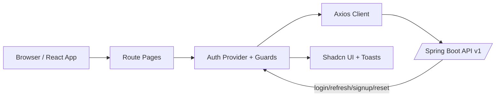

# Auth App Frontend

Production-ready React + TypeScript frontend for AuthKit (Spring Boot auth backend), with Clerk-inspired auth UX and secure session handling.


## Login Screenshot


## Features

| Capability | Status | Notes |
|---|---|---|
| Login + silent refresh | Complete | Access token in memory, refresh via HttpOnly cookie |
| 3-step signup (email → OTP → password) | Complete | Validation + cooldown/resend UX |
| 3-step forgot-password reset | Complete | OTP verify + password reset flow |
| Protected routing | Complete | Guest-only and authenticated route guards |
| API error toasts | Complete | Global Axios interceptor sanitizes user-facing errors |

## Quick Start

```bash
git clone https://github.com/RK-625/auth-app-frontend
cd auth-app-frontend
cp .env.example .env
npm install
npm run dev
```

## Environment Variables

| Variable | Description | Default |
|---|---|---|
| `VITE_API_URL` | Backend API base URL used by local integration | `http://localhost:8083` |
| `VITE_ORG_NAME` | Organization/app label shown across UI screens | `MyApp` |

## Backend Dependency

Frontend API/auth flows depend on the backend repository:

- [AuthKit Spring Boot Backend (`RK-625/auth-app`)](https://github.com/RK-625/auth-app)

Run the backend locally before testing full auth flows.

## Architecture



## Commands

```bash
npm run dev
npm run test
npm run lint
npm run typecheck
npm run build
```
